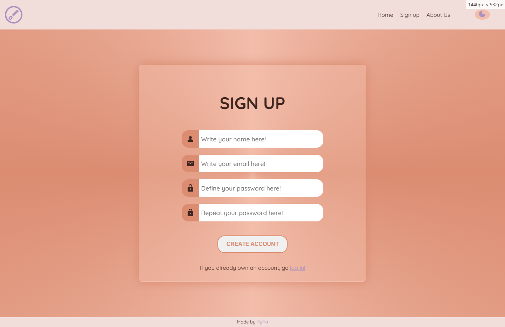
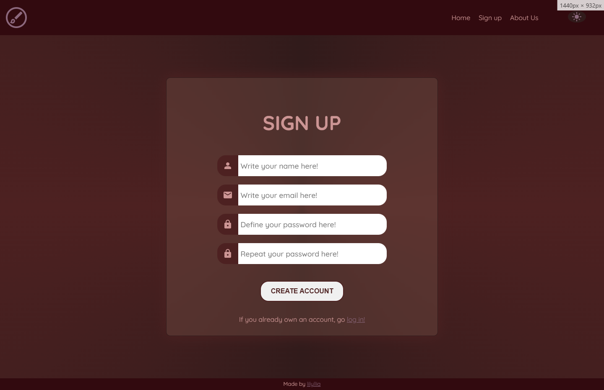
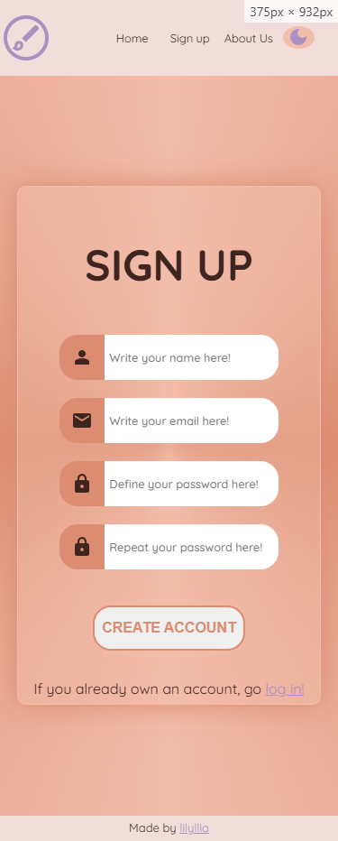
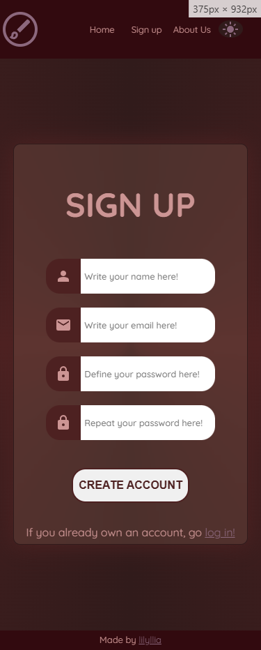
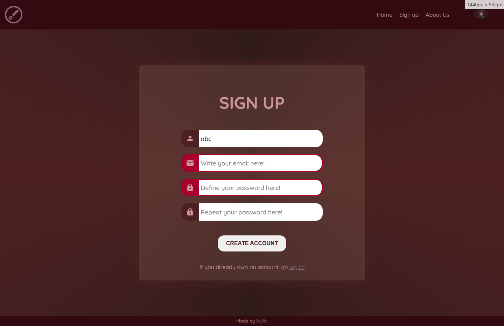

# Hello!
This is a project i made so i could practice these things:

#### Theme Switch Button
I already thought it was a super cool concept and was wondering how hard it would be to do (not that hard, really. kinda of fun).

#### Form Validation
It was a grat way to make me understand some basic JS concepts better!

#### Responsiveness
Honestly, every project i do i learn some much more and more about how to make a website more responsive, this was no exception.

#### Interactiveness
Making hoover and focus effects during this was super fun! Although since i was designing from head(coming up with stuff as i coded), i feel like it came together very nicely. Sadly, the screenshots don't show the hoovers, but they consist of some stuff sizing down, others changing colors, etc.. Simple but effective for user experience!

## Screenshots

### Desktop Lightmode

### Desktop Darkmode

### Mobile Lightmode

### Mobile Darkmode

### Active States

